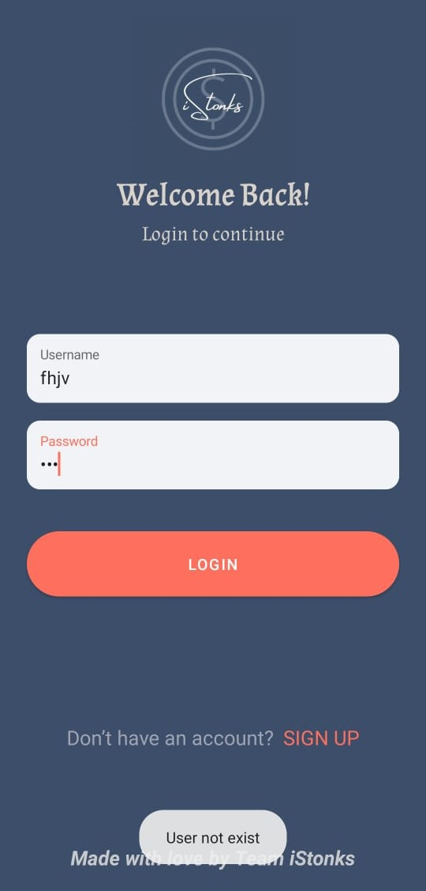
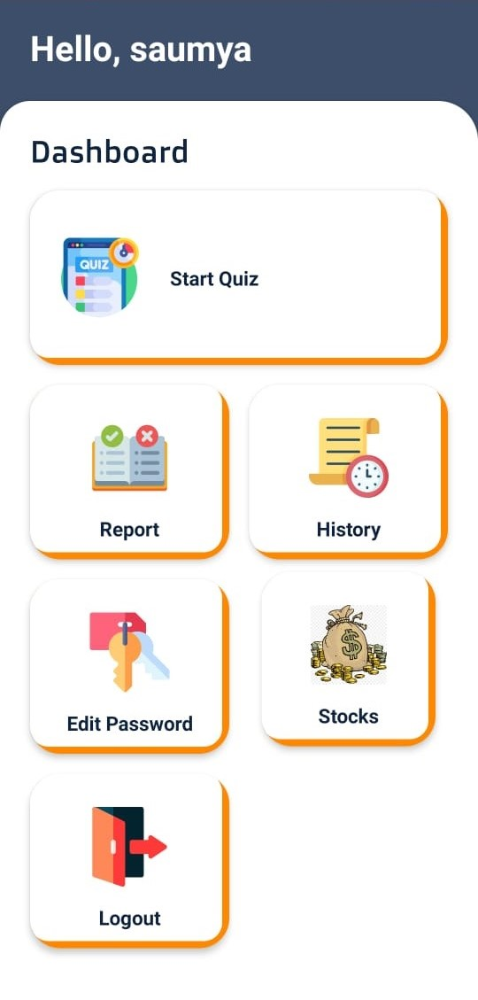
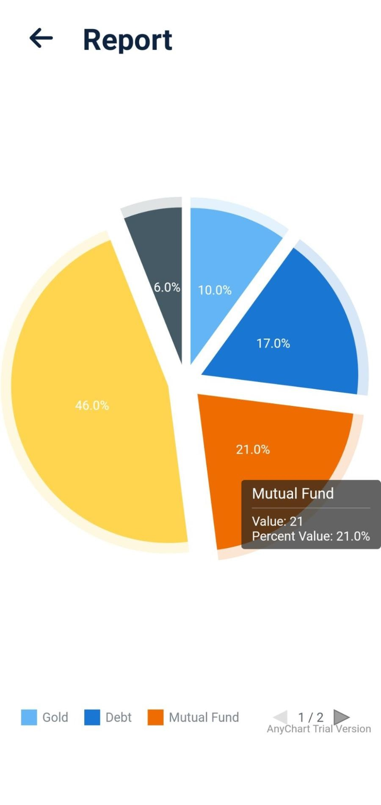
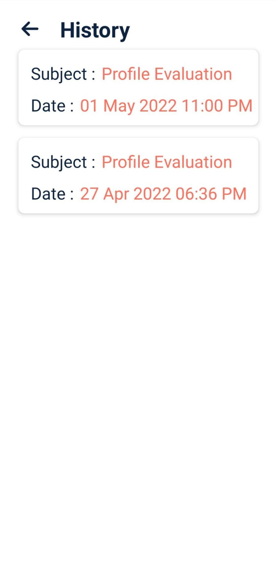
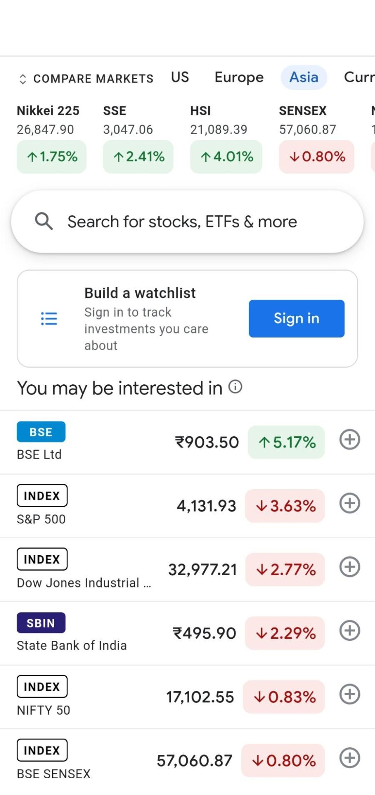
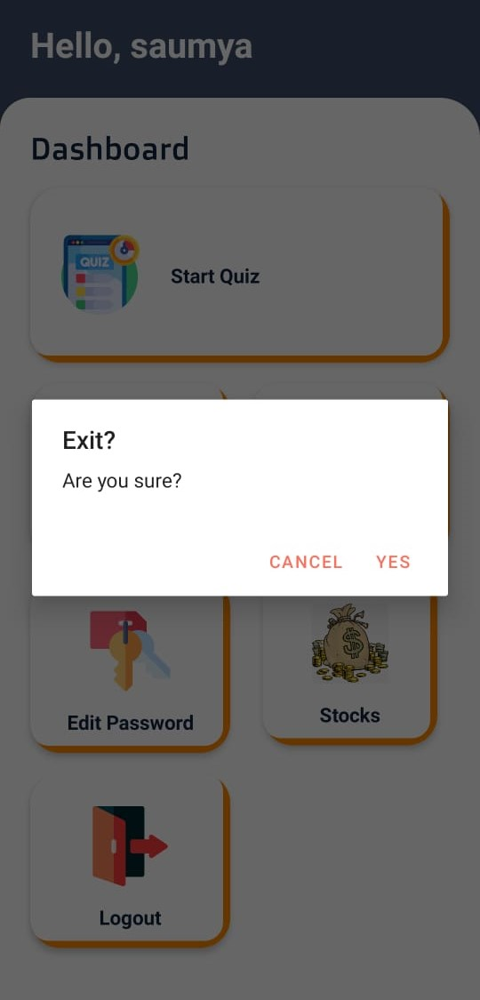

## iStonks - Android Application for New Investors
An Android application 📱 built using Java ♨️ and showing best practices of 🛠️ Room
-------------------
* Portfolio recommendation system based on the risk appetite of an individual and help individuals with the personal finance. Further, the user will be provided with *  custom recommendations and rebalancing options. The user will be able to get a personalized portfolio according to their risk appetite and grow wealth safely. The app * will also display the real-time stock market data.
------------
## ⚙️ Features
* App consists of a Profile and Risk Appetite Test
* Maintaining history of previous attempts.
* You can switch users using the Login/Register
* Feature to change to your current password
* Added loader while data is being fetched from API.
* Showing the result at the end.
* Implemented login, register,edit password, previous attempts all using SQL Lite DB using Room 

## 🚀 Technology Used

* Quiz App is build using Java
* Asynctask for asynchronous
* Room Persistence Library

## 📸 Screenshots

||||
|:----------------------------------------:|:-----------------------------------------:|:-----------------------------------------: |
|  |  |  |
|  |  |  |
|  |   


## ⚡ Dependencies Used
```sh
* Room Persistence Library 2.2.5
* Gson 2.8.6
```
